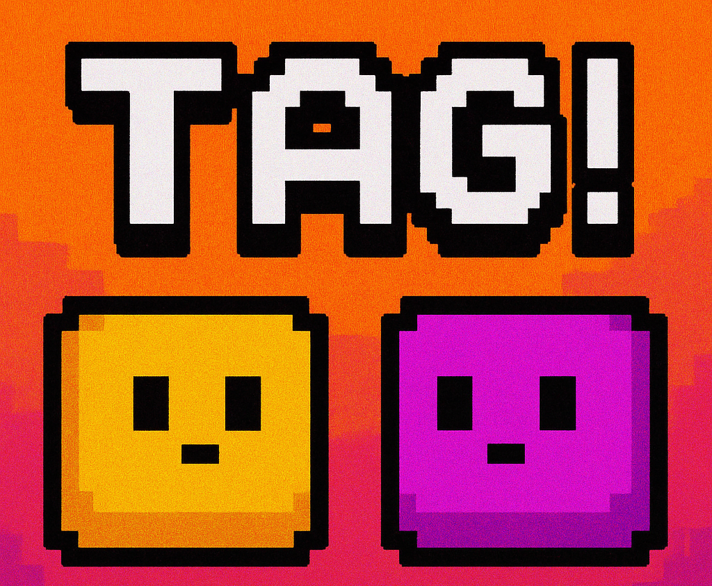

## TAG! Game
**Amy Xu & Yingchen Chen**

---

Honorable Mention in ECE 319 Honors Course.

Two players face off in a fast-paced, action-filled chase. A slide potentiometer is used in the pre-game menu, allowing players to adjust settings such as language (English or Spanish), map selection, and game duration. 

Each player controls three external buttons: **Left, Right, and Jump**.  
One player starts as the **tagger**, indicated by an arrow sprite above their character. The tagger must chase the runner while navigating static, obstacle-filled maps. Upon contact, an **explosion graphic** is displayed along with a sound — and the roles switch. 

The game ends when the timer runs out, and the player who is not "it" is declared the winner on the ending screen.

---

## Features
- **Buttons**: Hardware debounced (Left, Right, and Jump)
- **Slide potentiometer**: Adjusts menu settings before the game
- **Player and tagger sprites** move in response to button inputs and real-time results
- **Static platforms** act as obstacles while players navigate the map
- **Sounds**: Menu selection, jump, and tagging/explosion
- **Final winner** determined based on result at timer countdown
- **Languages**: English and Spanish

---

## Requirements Met
- Six buttons: (Left, Right, and Jump) × 2
- Slide potentiometer: Adjusts game volume, sampled by ADC at 30 Hz
- Three sprites: Two player sprites, one tagger arrow sprite
- Three sounds through 5-bit DAC
- Three ISRs:
  - One for handling player movements
  - One for playing sounds (periodic interrupt)
  - One for timer countdown
- Score displayed when time expires, based on final standings
- Language options (English and Spanish) displayed at game start

